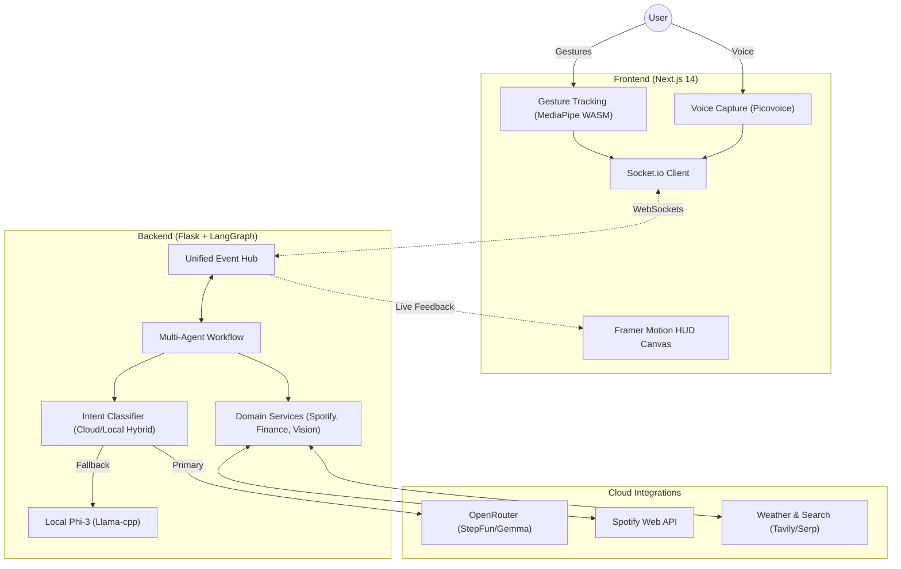

# 🪞 ReflectOS: The Intelligent Gesture-Driven HUD

[](#)
[](#)
[](#)

ReflectOS is a next-generation, AI-orchestrated **Smart Mirror / HUD** platform. Designed to eliminate traditional inputs, it leverages high-fidelity hand tracking, voice commands, and a distributed LangGraph brain to provide a seamless, holographic-style interface.

---

## ✨ Latest Enhancements

-   **🧘‍♂️ Zen Mode**: Toggled via the **Thumb Up** gesture to instantly declutter your display.
-   **🗣️ Realistic Voice**: Integrated `edge-tts` (`en-US-ChristopherNeural`) for natural, human-like responses.
-   **🚀 Local AI Fallback**: Deploying the **Phi-3-mini-4k** model locally to bypass API rate limits and ensure maximum privacy.
-   **🛡️ Gesture Stability**: Re-engineered detection engine with **Prioritized Indexing** and **Sticky Locking** to eliminate false triggers.

---

## 🚀 Feature Set

### 🖖 Interaction Layer
-   **Hybrid Input**: Seamlessly switch between voice (wake word: "Alfred") and gestures.
-   **Gesture Precision**: 
    -   `AIR_TAP`: High-speed selection and clicking.
    -   `GUN_TAP`: Thumb-trigger for menu navigation.
    -   `VOLUME_DIAL`: Precise analog control via hand rotation.
    -   `FIST_MOVE`: Deliberate 25-frame streak for system-wide interruptions.

### 🧠 The "Brain" (AI Orchestration)
Powered by **LangGraph** and **OpenRouter**, ReflectOS supports:
-   **Intent Classification**: Multi-stage routing for Finance, Vision, Media, and Search tasks.
-   **Dual-Layer LLM**: Real-time cloud processing with **StepFun Flash** and local fallback with **Phi-3**.
-   **Tool Suite**: Spotify Web API, PostgreSQL Finance Ledger, Tavily Web Search, and Local ONNX Vision models.

### 📺 HUD Modules
-   **Finance Terminal**: Real-time spending analysis and peer-to-peer debt tracking.
-   **Media Hub**: Full-stack Spotify and YouTube control.
-   **Vision Scanner**: Scene description, OCR, and Style feedback for outfits.
-   **System Stats**: Real-time biometric mood visualization and hardware telemetry.

---

## 🏗️ Architecture



---

## 🛠️ Setup & Installation

### 1. Requirements
-   **OS**: Linux (Arch preferred), macOS, or Windows WSL2.
-   **Runtime**: Node.js 18+, Python 3.10+.
-   **Hardware**: Webcam (720p+ recommended) and Microphone.

### 2. Backend Setup
```bash
cd backend
python -m venv venv
source venv/bin/activate
pip install -r requirements.txt
python download_model.py  # Initiates local Phi-3 download
python app.py
```

### 3. Frontend Setup
```bash
cd frontend
npm install
npm run dev
```

### 4. Configuration (.env)
Ensure your `.env` files are populated with the necessary keys for Spotify, OpenRouter, and Picovoice. Reference the [Implementation Plan](file:///home/mihir/.gemini/antigravity/brain/cb72808d-2c07-4a09-b2fc-edb29374517c/implementation_plan.md) for a full variable list.

---

## 🖖 Gesture Interaction Guide

| Gesture | Action |
| :--- | :--- |
| **Pinch (Air Tap)** | Select / Click |
| **Thumb Up** | Toggle Zen Mode (HUD Hide/Show) |
| **Fist (Hold)** | System Interrupt / Exit |
| **Hand Rotate** | Analog Volume Control |
| **Two-Finger Gun Tap** | Open / Navigate Menu |

---

## 🏗️ Project Architecture
For a detailed breakdown of the system design and intelligence hierarchy, see [ARCHITECTURE.md](file:///home/mihir/Codes/ReflectOS/ARCHITECTURE.md).

---

## 📜 License
Privately held by MIHIRrPATIL. All rights reserved.
