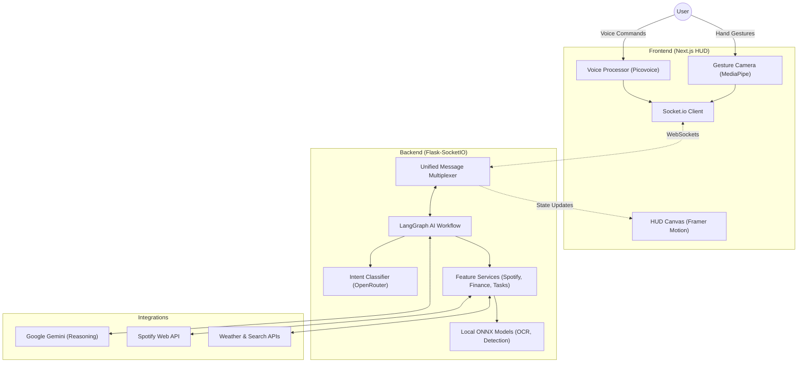

# ReflectOS: The Intelligent Gesture-Driven HUD Operating System

ReflectOS is a cutting-edge, AI-powered "Smart Mirror" and HUD (Heads-Up Display) platform. It eliminates traditional input methods like keyboards and mice, replacing them with **intuitive hand gestures** and **voice commands** to create a seamless, holographic-style user experience.

---

## 🚀 Feature Deep Dive

### 🧠 AI Intelligence Layer (The "Brain")
ReflectOS utilizes a LangGraph-powered reasoning engine that supports:
*   **Intent Classification**: Advanced routing of requests using OpenRouter (Gemini/StepFun) with local fallback.
*   **Contextual Memory**: Remembers personal facts and preferences (e.g., "Remember I like dark roast coffee").
*   **Composite Task Execution**: Handles multiple independent actions in a single command (e.g., "Show my balance and play some jazz music").
*   **Search & Knowledge**:
    *   **Pro-Web Search**: Real-time web searching via Tavily and SerpApi for news, sports, and live data.
    *   **Knowledge Scanner**: Integrated reticle for identifying objects and text via OCR and Object Detection.

### 🖖 Gesture & Control (The "Input")
*   **High-Precision Cursor**: Smooth, EMA-filtered cursor with interactive glow and click pulse.
*   **Air Tap & Gun Tap**: Intuitive pinching and thumb-tapping for selection and menu control.
*   **System Media Control**: Native OS volume and playback control via hand rotation and swipes.
*   **HUD Menu Arc**: Draggable, semi-circular navigation fragments.

### 📺 HUD Modules (The "Interface")
*   **Finance Terminal**: Detailed spending tracking, debt management ("who owes what"), and category-wise analysis.
*   **Media Center**: Full Spotify integration (Playlists, Device Switching, Queue Management) and YouTube search/playback.
*   **Timeline & Tasks**: Monospaced to-do lists and calendar management.
*   **Vision Suite**:
    *   **Style Scan**: AI fashion feedback based on your current outfit.
    *   **Text Reader**: Instant OCR for reading physical documents.
    *   **Object Identifier**: Deep-scene description and item detection.
*   **System Diagnostics**: Terminal widget for logs and Process Monitor for AI execution tracking.
*   **Biometric Mood**: Waveform visualization for mood and mental state tracking.

## 🏗️ System Architecture

ReflectOS utilizes a distributed event-driven architecture to ensure low-latency interactions.



---

## 🛠️ Environment Configuration

### Backend Configuration
Create a `.env` file in the `/backend` directory:

| Variable | Description | Source |
| :--- | :--- | :--- |
| `GOOGLE_API_KEY` | Primary API key for Gemini LLM models. | [Google AI Studio](https://aistudio.google.com/) |
| `OPENROUTER_API_KEY` | High-reliability fallback for LLM execution. | [OpenRouter](https://openrouter.ai/) |
| `WEATHER_API_KEY` | Real-time weather data fetching. | [OpenWeatherMap](https://openweathermap.org/) |
| `SPOTIPY_CLIENT_ID` | Spotify Developer application ID. | [Spotify Dashboard](https://developer.spotify.com/) |
| `SPOTIPY_CLIENT_SECRET` | Spotify Developer application secret. | [Spotify Dashboard](https://developer.spotify.com/) |
| `SPOTIPY_REDIRECT_URI` | Redirect URL (e.g., `http://127.0.0.1:8888/callback`). | Spotify Dashboard |
| `TAVILY_API_KEY` | AI-native web search for real-time information. | [Tavily](https://tavily.com/) |
| `SERPAPI_API_KEY` | Secondary search engine for deep queries. | [SerpApi](https://serpapi.com/) |
| `POSTGRES_USER` | PostgreSQL database username. | Local Install |
| `POSTGRES_PASSWORD` | PostgreSQL database password. | Local Install |
| `POSTGRES_DB` | Database name (`reflect_os`). | Local Install |
| `REDIS_HOST` | Redis server address for session caching. | Local Install |

### Frontend Configuration
Create a `.env.local` file in the `/frontend` directory:

| Variable | Description | Source |
| :--- | :--- | :--- |
| `NEXT_PUBLIC_PICOVOICE_ACCESS_KEY` | Access key for Picovoice Porcupine (Wake Word). | [Picovoice Console](https://console.picovoice.ai/) |

---

## 🔄 Technical Process Flow

ReflectOS operates on a high-speed multiplexed pipeline:

1.  **Input Capture**: The Frontend (Next.js) captures raw video frames and uses **MediaPipe WASM** to extract 21 hand landmarks.
2.  **Gesture Normalization**: The `GestureEngine` translates raw coordinates into normalized vectors, applying **EMA smoothing** to stabilize movement.
3.  **Real-time Streaming**: Normalized gestures and voice audio are streamed to the Python Backend via **Socket.IO WebSockets**.
4.  **Intent Orchestration**: The Backend receives the message, and the **LangGraph-driven AI pipeline** classifies the intent using an LLM.
5.  **Tool Execution**: Depending on the intent, the system triggers specific tools (Spotify API, SQL Expense queries, Vision models, etc.).
6.  **Closed-Loop Feedback**: Results are sent back to the Frontend to update the HUD visuals and play TTS audio responses simultaneously.

---

## 🏗️ Setup Instructions

### Backend (Python)
```bash
cd backend
pip install -r requirements.txt
python app.py
```

### Frontend (Next.js)
```bash
cd frontend
npm install
npm run dev
```
